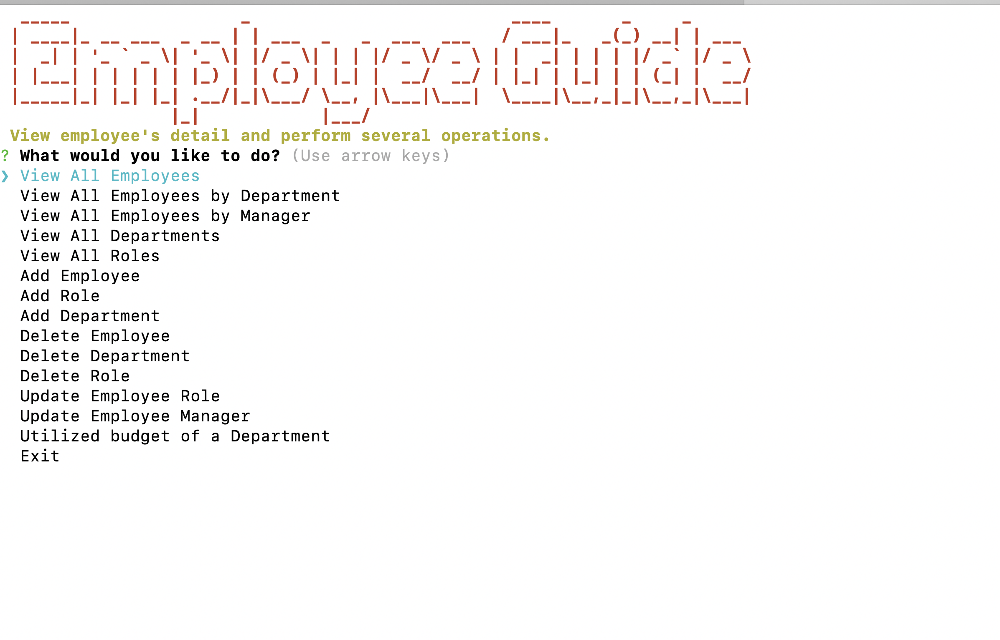
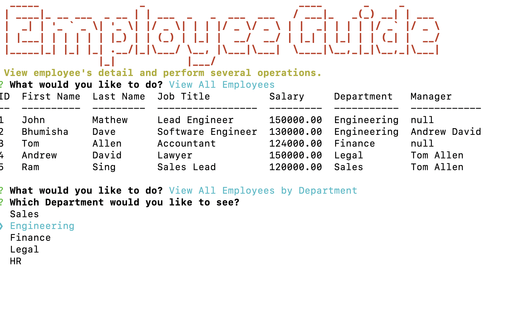
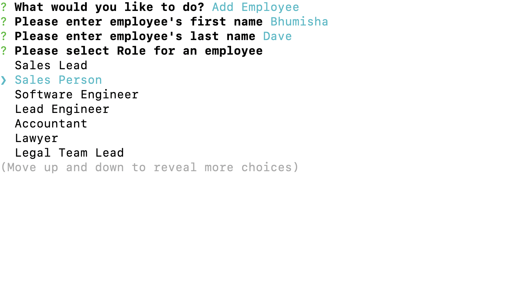
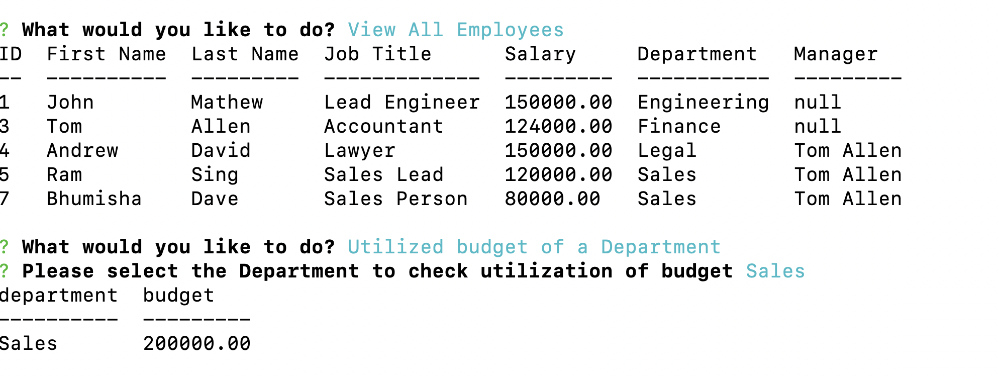

# Employee-Guide
## Description
    Employee Guide is recording and showing all details about the employees of the company. Roles, Managers and Department have been assigned to manager. User can perform DDL and DML operations on given database. MySQL CMS Delationsal Database includes Employee / Department and Role tables
   
    The Project is developed in node.js. I have used Inquirer node libraries to get different details from user. MySQL is used to store data in database. Mysql2 is npm library which help to connect to database and perfrom DDL, DML operations.

    If you have not added node than please install node and than npm install. It will deploy all required node modules to project than run node server.js
    All code is written in ES6.

## Installation
To install following dependencies run the following command: it will install, inquirer , console.table, mysql2, node-banner and dotenv libraries

npm install

## Project Deployment / GitHub Detail
This project is deployed in Github. User can go thru files and clone the project.
For clone the project use below options or you can download Zip file.

SSH - "git@github.com:bhumisha/employee-guide.git"

HTTPS - "https://github.com/bhumisha/employee-guide.git"

## Project Source code :

https://github.com/bhumisha/employee-guide

## Video Link
https://drive.google.com/file/d/1gO6LIgbnQ0qxvmAxOw0ZnptnwqlHYjnJ/view?usp=sharing

## Images
The following screen demonstrates the application functionality

Landing page

View Employee Detail with Role and Department

Add new Employee

View Budget allocated to selected Department

DB Schema
 
 

#### Questions
If you have any additional questions about the repo, open an issue or contact me directly at bhumishadave@gmail.com. You can fine more of my work at bhumisha
